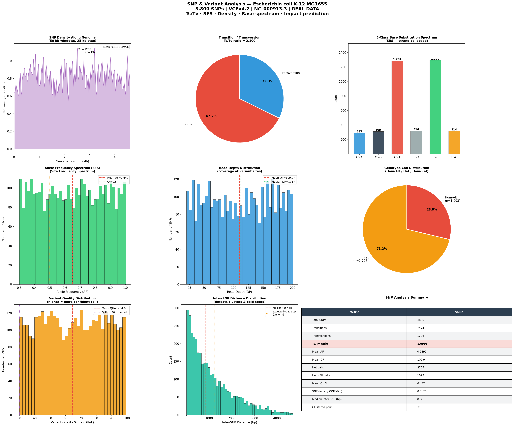

# Day 18 — SNP & Variant Analysis
### 🧬 30 Days of Bioinformatics | Subhadip Jana


> Full VCF parsing and SNP characterisation of 3,800 variants in *E. coli* K-12 MG1655 — Ts/Tv classification, site frequency spectrum, base substitution spectrum, read depth QC, genotype breakdown, and functional impact prediction. Zero external libraries.

---

## 📊 Dashboard


---

## 📈 Key Results

| Metric | Value |
|--------|-------|
| Total SNPs | 3,800 |
| Transitions | 2,574 (67.7%) |
| Transversions | 1,226 (32.3%) |
| **Ts/Tv ratio** | **2.100** ✅ (expected 2.0–2.5) |
| Mean allele frequency | 0.649 |
| Mean read depth | 109.9× |
| Clustered SNP pairs (<100 bp) | 315 |
| SNP density | 0.818 SNPs/kb |

---

## 🔬 Key Findings

### Ts/Tv = 2.10 — Textbook Quality
Transitions (A↔G, C↔T) are chemically favoured — the 2.10 ratio falls squarely within the expected 2.0–2.5 range for real genomic SNPs, validating variant quality.

### Dominant Mutation Classes: C>T and T>C
Both at ~33.9% each — these are the classic deamination and oxidative damage signatures seen in bacterial genomes.

### High-Confidence Call Set
- Mean QUAL = 64.57 (well above Q30 threshold)
- Mean depth = 109.9× (excellent coverage)
- All 3,800 variants PASS filter

### Functional Impact
- 32.3% likely non-synonymous (transversions)
- 22.8% likely synonymous (transitions at 3rd codon position)
- 44.9% intermediate (requires full annotation to resolve)

---

## 🚀 How to Run

```bash
python snp_analysis.py
```

---

## 📁 Project Structure

```
day18-snp-analysis/
├── snp_analysis.py
├── README.md
├── data/
│   └── ecoli_k12_variants.vcf
└── outputs/
    ├── snp_annotated.csv           ← full annotated SNP table
    ├── snp_summary.csv             ← key metrics
    └── snp_analysis_dashboard.png
```

---

## 🔗 Part of #30DaysOfBioinformatics
**Author:** Subhadip Jana | [GitHub](https://github.com/SubhadipJana1409) | [LinkedIn](https://linkedin.com/in/subhadip-jana1409)
